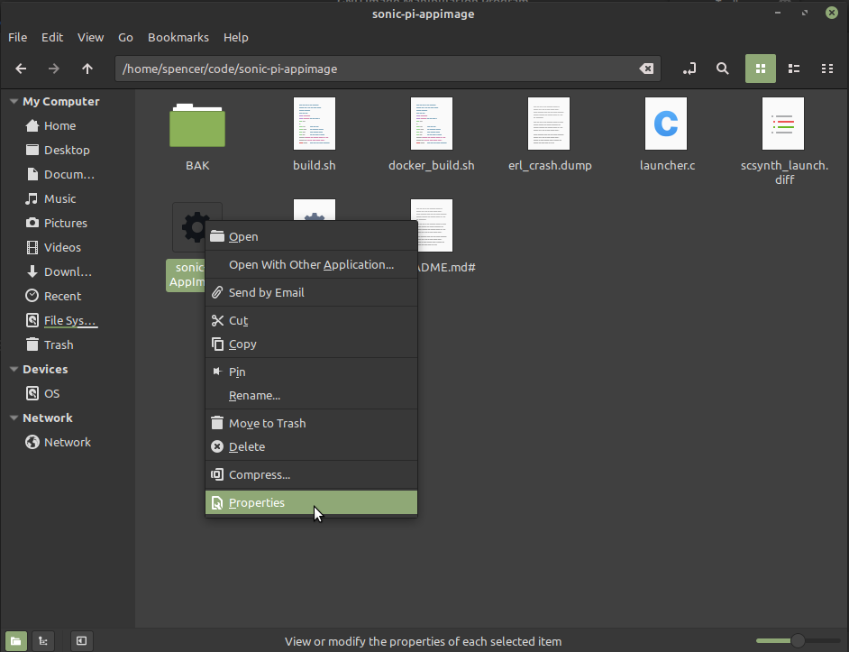
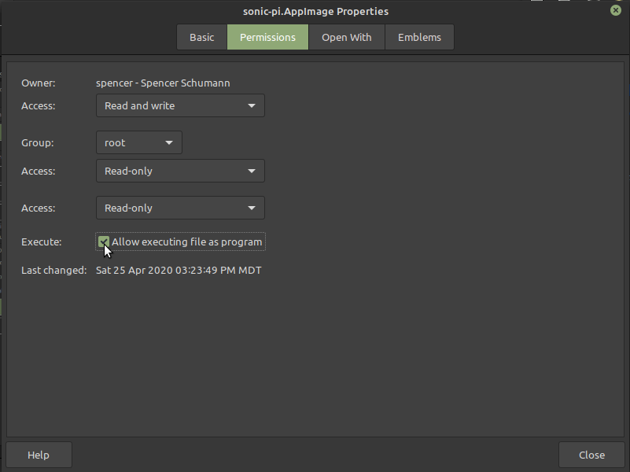

# Sonic Pi AppImage

This project builds [Sonic Pi](https://sonic-pi.net/) as an AppImage
for Linux. The AppImage is a single file that contains a full Sonic Pi
distribution.

Latest release: [v3.2.2](https://github.com/spencerschumann/sonic-pi-appimage/releases/download/v3.2.2-001/sonic-pi.AppImage)

*IMPORTANT* After downloading, the file's permissions need to be
 changed to make it executable before you can run it. This can be done
 from the command line:

```shell
$ chmod a+x sonic-pi.AppImage
$ ./sonic-pi.AppImage
```

Alternatively, you can also use the graphical file explorer, for
example, using Linux Mint, first right click on the file and choose
Permissions:



Next, check the Execute box:




## Jack

This build of Sonic Pi requires Jack. Installing and configuring Jack
can present some challenges. Eventually I'm hoping to allow this build
to fall back to other audio options if Jack is not available, but for
now Jack is a requirement.

Before starting Sonic Pi, I launch Jack this way:

```bash
$ pasuspender -- jackd -d alsa -d hw:1
```

If that does not work for you, you can try removing the `pasuspender--`
piece, or try [these instructions](https://github.com/overtone/overtone/wiki/Installing-and-starting-jack).


## Limitations

These builds of Sonic Pi are still a work in progress, and not all
features are supported yet.

* MIDI functionality is untested and is most likely not working.

* OSC functionality is also not yet working (Erlang needs to be
  packaged in the AppImage to make it work).

* Only very basic testing has been performed with this build, and
  there are likely other unknown problems with it.


## Chromebook Support?

This AppImage may or may not work with Chromebooks. Given that Sonic
Pi was designed to be used in classrooms, and given the large number
of Chromebooks in schools, I'm hoping that this build will be usable
on Chromebooks; however, I don't have a Chromebook to test
with. Volunteer testers are welcome!
